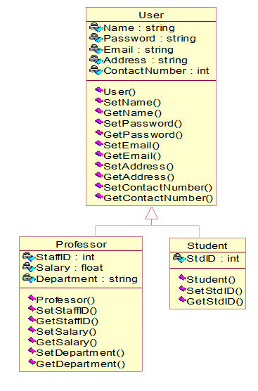

# Tugas RPL OOP
[](LICENSE)

> Implementasi pemrograman berbasis objek (PBO) dari studi kasus mata kuliah Rekayasa Perangkat Lunak.




## Development environment

* OpenJDK 11.0.9
* Gradle 6.7


## Install

```sh
.\gradlew.bat clean build
```

## Usage

```sh
.\gradlew.bat run
```

## Run tests

```sh
.\gradlew.bat clean test
```


## Author

👤 **Caesar Rio Anggina Toruan (185250207111034)**

👤 **Hamdani Al-Ikhsan (185150201111061)**

👤 **Marvel Timothy Raphael Manullang (185150200111089)**

👤 **R. Komang Eling Pramuatmaja (185150200111081)**

## 📝 License

Copyright © 2020 [Eling Pramuatmaja](https://github.com/elingp).

This project is [MIT](LICENSE) licensed.
